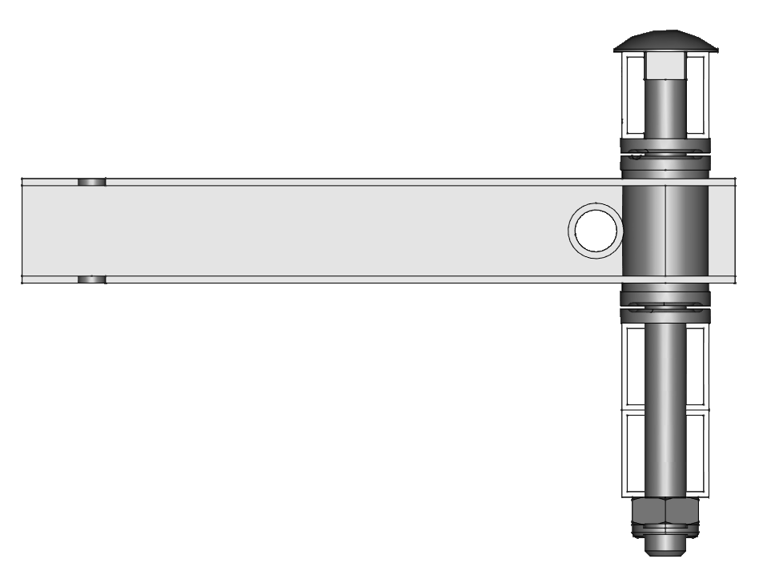

# Assemblage du châssis et du toit

Nous vous rappelons que les écrous-freins (type « nylstop ») ne sont pas prévus pour être démontés et remontés ; ils doivent être remplacés par un écrou neuf le cas échéant.
Tous les écrous et vis doivent être serrés suffisamment fort, mais prenez garde aux tubes carrés en aluminium qui vont s’écraser si vous serrez trop fort. Vérifiez que votre serrage ne provoque pas de déformation visible. Selon nos essais, il faut approcher l’écrou jusqu’au contact, puis faire encore un demi-tour.

:::{figure-md}


Exemple de tube déformé par un serrage excessif
:::

Certains tubes qui doivent absorber des efforts plus importants doivent être munis d’entretoises (tel qu’indiqué dans le plan). Vous pourrez alors serrer plus fort.

Les quantités indiquées dans la nomenclature pour la quincaillerie sont parfois légèrement en excès de ce qui est réellement utile. Ne soyez donc pas surpris s’il vous reste un écrou à la fin du montage !

Le cadre est constitué de tube aluminium 25 mm x 25 mm x 2 mm d’épaisseur. Il faut compter environ 40 mètres de tubes pour la version intégrale.

Pour simplifier l’assemblage, des standards d’assemblage ont été définis :

**Assemblage de 2 tôles**
vis M6 14 mm (QIN14)
rondelle M6 côté écrou (QIN12)
écrou M6 (QIN09)

```{image} img/assemblage_2_toles.png
:alt: Assemblage 2 tôles
:align: right
```

**Assemblage d’un tube et d’une tôle**
vis M6 45 mm (QIN45)
rondelle M6 pour la tête de vis ou écrou contre un tube ; inutile côté tête de vis si celle-ci vient contre une tôle inox (QIN12)
écrou M6 (QIN09)

```{image} img/assemblage_tube_tole.png
:alt: Assemblage tube tôle
:align: right
```

**Assemblage de 2 tubes**
vis M6 60 mm (QIN60)
rondelle M6 pour la tête de vis ou écrou contre un tube ; inutile côté tête de vis si celle-ci vient contre une tôle inox (QIN12)
écrou M6 (QIN09)

```{image} img/assemblage_2_tubes.png
:alt: Assemblage 2 tubes
:align: right
```

**Assemblage de 3 tubes**
vis M6 90 mm (QIN90)
rondelle M6 pour la tête de vis ou écrou contre un tube ; inutile côté tête de vis si celle-ci vient contre une tôle inox (QIN12)
écrou M6 (QIN09)

```{image} img/assemblage_3_tubes.png
:alt: Assemblage 3 tubes
:align: right
```

## Assemblage de la structure en tubes

### Étape 1


### Étape 2


### Étape 3


### Étape 4

À partir de cette étape, vous pouvez surélever le châssis en le posant sur des caisses, pour travailler plus confortablement.


### Étape 5


### Étape 6


### Étape 7


### Étape 8


### Étape 9


### Étape 10


### Étape 11


### Étape 12


### Étape 13


### Étape 14


### Étape 15


### Étape 16


### Étape 17

Si vous aviez surélevé le châssis, vous pouvez maintenant le redescendre au niveau du sol pour faciliter l’installation du toit.


### Étape 18


### Étape 19


### Étape 20


## Montage de la direction

Certains tubes sont masqués pour une meilleure lisibilité

### Fixer CHO45 et T16


### Placer CHO44 sur son axe de rotation

Utilisez la rondelle à trou carré directement sous la plaque CHO45, puis un roulement, puis une entretoise. Le deuxième roulement se place entre la potence CHO44 et la traverse T16. Fixer aussi les plaques CHO46. Contrairement à ce qui est indiqué sur le dessin, nous recommandons de placer un écrou classique + un contre-écrou « nylstop » afin de pouvoir les serrer l’un contre l’autre pour éviter tout risque de desserrement avec les vibrations, sans pour autant serrer excessivement les roulements. Commencer par serrer le premier écrou, mais pas trop fort pour ne pas gêner la rotation de la potence. Maintenir ensuite cet écrou avec une clé plate, et serrer le second écrou contre lui.


### Placer les deux CHO47 sur leurs axes de rotation

Utiliser 4 roulements en tout, directement au-dessus et au-dessous des CHO47. Placez des entretoises dans les traverses T11, T12 et T13 afin d’éviter qu’elles ne s’écrasent lors du serrage. Contrairement à ce qui est indiqué sur le dessin, nous recommandons de placer un écrou classique et de le serrer modérément afin de ne pas écraser les roulements, puis un contre-écrou « nylstop » qu’il faudra serrer contre le premier écrou (en l’empêchant de tourner pendant le serrage avec une seconde clé plate). Ceci afin d’éviter tout risque de desserrement avec les vibrations, sans pour autant serrer excessivement les roulements. Finalement, monter les biellettes T18. Là aussi, utilisez deux écrous à chaque articulation (elles supportent peu d’efforts et n’ont donc pas de roulement, serrez les écrous l’un contre l’autre, mais ne serrez pas les pièces entre elles pour ne pas gêner la rotation).




### Fixer le guidon CHO04

Utiliser le support CHO38 et les vis en U CHO06. L’inclinaison du guidon sera à ajuster après le placement du siège pour une position de conduite confortable (légèrement penché vers l’avant). Il faudra alors serrer fermement les 4 écrous pour bloquer son inclinaison.


## Montage des tôles

Les tôles peuvent être assemblées par boulonnage (M4 ou M6) ou vis à tôle (QIN20) selon l’accessibilité. Attention les vis à tôle ne doivent pas êtres serrées trop fort.


Les parties saillantes des tôles doivent êtres recouvertes de joints bord de tôle (DIV02).
Un joint bord de tôle doit être posé à l’avant du panneau solaire. Ce joint limite les coulures d’eau de pluie sur le conducteur. Le ressaut faisant office de rigole n’est pas très haut, mais nous n’avons pas trouvé de référence plus satisfaisante à ce stade.


## Pose du panneau solaire

Cette opération doit se faire à la fin du montage (afin de ne pas gêner la manipulation du vhéliotech) et ne pas dégrader le panneau.
Prépositionner le panneau et vérifier les dimensions et l’équerrage des tubes (en exagérant, il ne faut pas que la structure forme un losange, sinon ajuster au moyen d’une sangle à cliquet.
Nettoyer la surface inférieure du panneau et les tubes.
Mettre un filet de silicone (translucide et résistant aux intempéries) sur la structure. Poser le panneau (opération à faire à 2 personnes). Mettre du poids sur le panneau aux endroits collés. Attendre une nuit pour retirer le poids.
Passer ensuite le fil dans la structure aluminium.