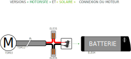
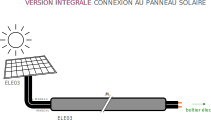
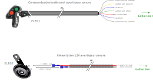
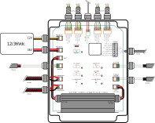

# Installation de l’électricité

Les équipements cycle électriques ont été choisis avec un soin particulier pour éviter toute obsolescence programmée (ce qui n’est pas facile dans le domaine du cycle).
L’électrification des véhicules est discutable dans la mesure où il projette dans un monde d’objets éphémères, car rapidement obsolètes dès qu’un élément ne fonctionne plus. Nous avons choisi des éléments qui peuvent se remplacer individuellement, se reconditionner… pour une durée de vie maximum de l’ensemble.
Par ailleurs, le secteur des batteries avance à grands pas et il est probable que d’ici quelques années, pour avoir du 36V embarqué, nous aurons recours à d’autres technologies ou des systèmes de batteries de secondes vies. Le vhéliotech a été pensé pour pouvoir être compatible avec ces futurs produits/technologies à venir.
Le moteur BAFANG M400 (TSM03) est un moteur robuste, éprouvé et facilement réparable. Des tutoriels existent, par exemple cette vidéo explique comment le démonter, si toutefois vous aviez besoin de remplacer une des pièces internes : https://www.youtube.com/watch?v=nm6UTwLRays
Le moteur BAFANG peut se connecter sur presque n’importe quelle batterie 36V (sous réserve des connecteurs) avec 2 fils (+ et -).
La batterie GREENCELL 36V 14,5 Ah (ELE04) peut se trouver sur au moins 3 sites marchands très facilement. Cette batterie peut être reconditionnée par la société doctibike (changement des cellules, conservation du boîtier et BMS) après un premier cycle de vie.

## Versions « motorisée » et « solaire »

### Moteur

Note : si vous avez deux batteries, vous ne pouvez en connecter qu’une à la fois. Lorsque la première est déchargée, intervertissez les deux batteries.

## Version « solaire »

### Charge solaire

Note : si vous avez deux batteries, vous ne pouvez en connecter qu’une à la fois. Lorsque la première est chargée, connectez le MPPT sur l’autre.

## Version « intégrale »

### Moteur

Note : si vous avez deux batteries, vous ne pouvez en connecter qu’une à la fois. Lorsque la première est déchargée, intervertissez-les. Vous devez aussi gérer la recharge des deux batteries (lorsque la première est rechargée, branchez le connecteur sur l’autre batterie).

### Charge solaire

### Platines avant

Notez que les prises USB s’alimentent en 12V ; elles sont équipées à l’intérieur d’un convertisseur de tension 12V vers 5V

### Platines arrière

### Commodo (commande clignotants et phares)

### Connexions boîtier

#### Luminaires

#### Commodo

#### Moteur, batterie, solaire

