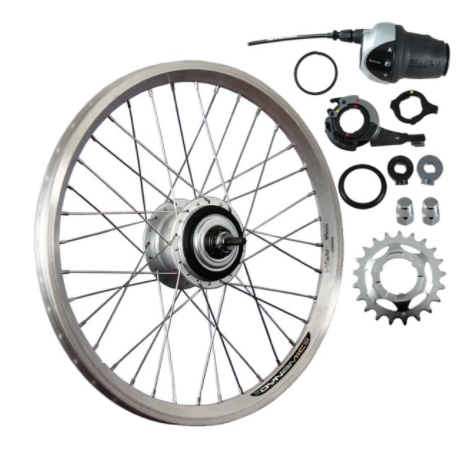
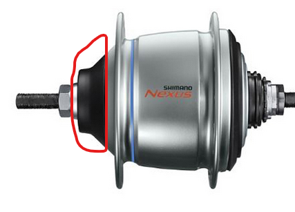
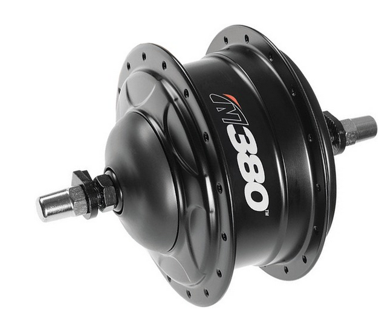
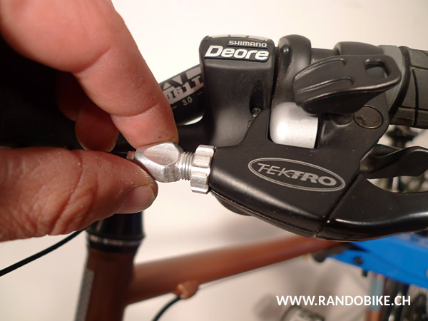
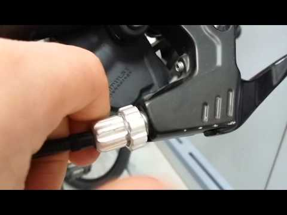
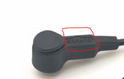
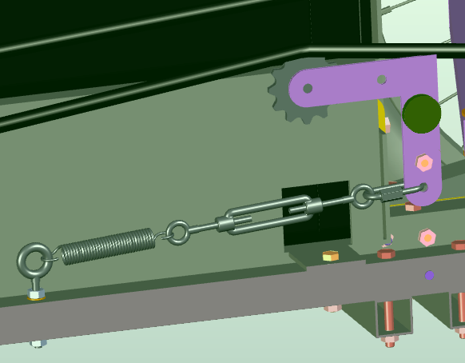
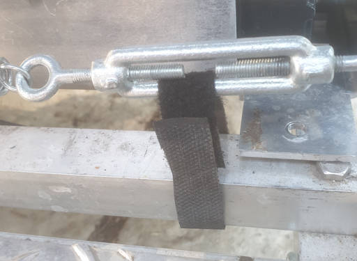

# Montage des pièces cycle

Cette section relève principalement de connaissances généralistes sur les vélos. De nombreux tutoriels existent sur internet, nous vous proposons quelques liens pour certaines étapes. Certains constructeurs de pièces vélo proposent aussi des instructions détaillées destinées aux assembleurs de vélos.
L’installation de la plupart des pièces sera plus aisée en posant le châssis sur des caisses ou des parpaings, afin que les roues ne touchent pas le sol une fois fixées. Il est également possible de basculer le vhéliotech sur un côté, par exemple pour le montage de la roue arrière.
Veillez à adopter une position ergonomique pour le montage et l’entretien des pièces cycles : basculez le Vhélio sur un côté pour accéder à la roue avant du côté opposé, ou sur l’arrière pour accéder à l’ensemble des trois roues. Pour travailler sur la transmission (dérailleur, chaîne, tendeur de chaîne) il est conseillé de garder le vhélio horizontal mais en surélevant la roue arrière, pour garder le sens de gravité qui a un impact sur le comportement de la chaîne.
Vous retrouverez l’ensemble des liens vers les tutoriels vidéos à la fin de cette section.

## Ensemble roue arrière, frein, et commande du moyeu

Un élément essentiel du vhéliotech est l’ensemble roue arrière avec le moyeu à vitesses intégrées. Nous avons retenu et testé deux options différentes, afin que vous puissiez choisir celle qui vous conviendra le mieux. Pour chaque version du vhéliotech (« basique », « motorisée », « solaire » et « intégrale »), nous proposons un moyeu ; mais ils sont parfaitement interchangeables et fonctionneront sur toutes les versions.

### Moyeu 8 vitesses Shimano Nexus 8

Ce moyeu est proposé pour les versions « basique » et « motorisée »
Il s’agit d’un moyeu à 8 vitesses Shimano Nexus 8, monté sur roue 20 pouces (ROU16) avec frein à tambour (ROU17)

#### Intérêts
- Produit avec un très bon rapport qualité/prix
- Bonne efficacité
- Nos tests ont permis de constater la solidité de la jante et du rayonnage
#### Contraintes
- Réglage à réaliser avec soin pour éviter les craquements
- Moyeu qui n’est pas prévu pour tirer des charges lourdes avec moteur
#### Particularités de montage
- Nous proposons la variante avec frein à tambour (notez que la roue arrière est la moins critique pour le freinage, les roues avant ayant une bien meilleure adhérence en cas de freinage fort)
- Retirer la bague en plastique (entourée en rouge) en dévissant l’écrou.
- Revisser l’écrou sans serrer.
- Fixer le frein à tambour au cadre pour faire une contre-poussée (trou à réaliser dans le tube aluminium du châssis)

### Moyeu à variation continue Enviolo CA 380

Ce moyeu est proposé pour les versions « Solaire » et « Intégrale ».
Il est monté sur une roue 20 pouces (ROU99).

#### Intérêts

- Produit haut de gamme, solide, adapté à une assistance électrique (y compris avec des charges lourdes)
- Nos tests ont permis de constater la solidité de la jante et du rayonnage
- Très grande ergonomie (changement de vitesse à variation continue : pas de cran, pas de craquements). À l’usage, on bouge la poignée en permanence de façon intuitive et avons toujours le bon rythme de pédalage) ; prise en main très simple et rapide.
- Amplitude de 380 % entre le plus petit rapport et le plus grand (contre 306 % pour le nexus 8)
- Facilité de montage
- Frein à disque à l’arrière (puissant et précis)

#### Contraintes

- Prix assez important
- Rendement un peu plus faible que le NEXUS 8 (entre 5 et 10 % d’écart selon les tests effectués – Ne pas hésiter à nous transmettre des informations chiffrées à ce sujet)
- Nécessite le montage du frein à disque (avec patte et étrier)

#### Particularités de montage

- L’ensemble ROU99 est prémonté avec la poignée (câble et gaine déjà réglés)

### Montage chambre à air et pneu

Tutoriel vidéo : https://youtu.be/gtGxtD4XkW4

- Poser le fond de jante sur la roue.
- Poser la bande anti-crevaison si concerné (sauf si utilisation de pneus anti-crevaison).
- Installer le pneu sur un seul flanc (respecter le sens de rotation du pneu qui permet une meilleure adhérence et évacuation de l’eau : une flèche est indiquée sur le flanc du pneu).
- Installer la chambre à air (très légèrement gonflée) dans le pneu en commençant par la valve.
- Finir de monter le second flanc du pneu en prenant garde de ne pas coincer la chambre à air.
- Gonfler à 4,5 bars (équivalent à 65 PSI), selon le pneu utilisé. Toujours respecter la pression qui est indiquée sur le flanc du pneu.

### Montage du disque de frein sur la roue

Cette étape ne concerne que le moyeu Enviolo CA 380. Il s’agira toutefois de la même procédure pour les roues avant.

Tutoriel vidéo (pour disque « 6 trous ») : https://youtu.be/sYLZjIjCx28

- Lors de la manipulation du disque et des plaquettes, assurez-vous de ne pas les salir avec de la matière grasse (graisse, huile, mains sales, etc.).
- Placer le disque de frein sur la roue en veillant au sens de rotation indiqué sur le disque.
- Disque « 6 trous » : serrer les vis dans l’ordre suivant : la 1re vis, puis la vis opposée (pas celles à côté) ; procéder en étoile et pas en cercle.

### Montage de la roue arrière

- Mettre la roue en place.
- Serrer les écrous de l’axe de la roue.

### Montage de l’étrier de frein

Cette étape ne concerne que le moyeu Enviolo CA 380. Il s’agira toutefois de la même procédure pour les roues avant.

- Si ce n’est pas déjà fait, monter les plaquettes dans l’étrier de frein.
- Monter l’étrier de frein sur le châssis avec le support de frein CHO34 (ne pas serrer les deux vis, les réglages de l’étrier se feront plus tard).

### Fixation des câbles et poignées

- Passer les 2 ensembles câble + gaine (variation de vitesse et frein) le long du châssis puis le long du côté droit du guidon, en fixant les gaines à intervalles réguliers avec de la bande autoagrippante scratch ; le câble de vitesse est déjà raccordé au moyeu à vitesse, le câble de frein sera à raccorder au moment du réglage. Assurez-vous que le guidon peut tourner librement sans tirer sur les gaines, et qu’elles ne peuvent se coincer nulle part.
- Mettre la poignée de changement de vitesse et le levier de frein sur le guidon, du côté droit (inutile de serrer à ce stade, vous pourrez faire les ajustements pour une position de conduite confortable quand tout sera en place)

### Réglage du frein

Cette étape ne concerne que le moyeu Enviolo CA 380. Il s’agira toutefois de la même procédure pour les roues avant.
Tutoriel vidéo (activer les sous-titres) : https://youtu.be/NmqGeLNcVIg

- Vérifier que les vis de tension au guidon et à l’étrier soient serrées

:::{figure-md}

vis dessérrée
:::

:::{figure-md}

vis sérrée
:::

- Câbler l’étrier : insérer le câble de frein dans l’étrier et le positionner dans la vis. Le câble doit en étant tiré faire pivoter le bras de l’étrier. Laissez-le au repos c’est-à-dire sans tension de câble et tirez sur le câble avec la main juste pour éviter qu’il y ait du mou, mais sans que cela fasse pivoter le bras de l’étrier. Serrer la vis qui maintient le câble (sans forcer).
- Régler la plaquette fixe : la plaquette fixe n’est pas mobilisée par la tension du câble. Elle doit être suffisamment proche pour effectuer l’action de pincement du disque quand la plaquette mobile pousse sur le disque, et suffisamment loin du disque pour éviter un frottement. Pour cela, commencez par serrer la molette de la plaquette fixe fixe (molette rouge, à l’aide d’une clé Torx de 25) jusqu’à ce que la plaquette touche le disque. Ensuite, desserrez-la d’un quart de tour.
- Régler la fixation de l’étrier : tenir le levier de frein arrière (à droite sur le guidon) serré à l’aide d’un élastique ou d’une chambre à air. Serrez les deux vis de fixation de l’étrier en procédant petit à petit (un tour sur la vis du haut, un tour sur la vis du bas) afin que l’étrier se positionne correctement par rapport au disque. Serrez au contact sans forcer.
- Vérifier et ajuster le réglage : relâchez le levier de frein (retirez l’élastique), puis faites tourner la roue à la main : si elle ralentit ou bien si vous entendez un bruit de frottement, le réglage doit être ajusté. Si elle tourne bien, mais que le freinage n’est pas efficace, le réglage doit être repris depuis l’étape « câbler l’étrier », il y a du mou quelque part dans le chemin du câble. Pour comprendre l’origine du frottement, utilisez une lampe frontale et une feuille blanche que vous mettrez derrière l’étrier, ceci afin de voir correctement l’espacement entre les plaquettes et le disque. Faites tourner la roue et observez bien le mouvement du disque.
  - Si le disque frotte d’un côté puis de l’autre, il est sans doute voilé, se référer à la notice d’utilisation.
  - Si le disque frotte une plaquette en biais (ou les deux), il faut ajuster le parallélisme des plaquettes (desserrez l’une ou l’autre des vis de fixation de l’étrier, repositionnez-le pour que les plaquettes soient bien parallèles au disque et resserrez les vis de fixation de l’étrier).
  - Si le disque frotte une plaquette de manière parallèle, il faut d’abord vérifier que l’étrier soit bien centré, il faut dans ce cas desserrer l’une ou l’autre des vis de fixation de l’étrier, et le repositionner pour que le disque soit centré entre les deux plaquettes. Si malgré le centrage, le frottement perdure : soit il s’agit de la plaquette mobile, soit de la plaquette fixe. Pour la plaquette mobile vérifier que le câble n’a pas été trop tendu lors du câblage de l’étrier et si ça n’a pas réduit la course du bras de l’étrier. S’il s’agit de la plaquette fixe, desserrez d’un quart de tour (molette rouge, sens antihoraire) et retestez en faisant tourner la roue jusqu’à disparition du frottement.
- TERMINER LE RÉGLAGE EN SERRANT à 4 NM LES VIS DE FIXATION DE L’ÉTRIER ET LA VIS DE MAINTIEN DU CÂBLE.

## Ensemble roues avant et freins

- Monter fonds de jante, bandes anti-crevaison, chambres à air et pneus (même procédure que pour la roue arrière).
- Gonfler entre 2 et 3 bars (équivalent à 29 et 43 PSI), selon le pneu utilisé. Toujours respecter la pression qui est indiquée sur le flan du pneu. 2 bars pour plus de confort, 3 bars pour plus de performance. Il est important que les deux roues avant soient gonflées à la même pression.
- Monter les disques sur les roues (même procédure que pour la roue arrière)
- Mettre les roues en place et serrer les écrous.
- Monter les étriers de frein équipés de leurs plaquettes sur le châssis avec les supports de frein CHO34 (ne pas serrer les deux vis, les réglages de l’étrier se feront plus tard)
- Passer l’ensemble câble + gaine de frein de chaque roue le long du bras de direction, puis le long du côté gauche du guidon, en fixant les gaines à intervalles réguliers avec de la bande autoagrippante scratch. Assurez-vous que le guidon peut tourner librement sans tirer sur les gaines ni les coincer.
- Fixer le levier de frein au guidon (poignée de gauche). Ce levier permet de commander les deux câbles et permet le frein parking.
- Régler les freins par la suite, une roue après l’autre (même procédure que pour la roue arrière).

## Moteur et pédalier

La version basique est équipée d’un pédalier sans moteur. Monter l’élément structurel au cadre (CUO38). Visser le boîtier de pédalier (TSM13). 
Pour les autres versions (motorisées), monter les tôles moteur (CHO08 et CHO09) au cadre. Visser le moteur (TSM03) avec les vis fournies.

### Écran

Les réglages de l’écran se font après connexion de la batterie.
L’écran se branche directement sur le moteur. Il faut configurer le diamètre de la roue arrière (20 pouces) sur l’écran dans le mode paramètres. Pour entrer dans le mode paramètre, le code est normalement « 1919 ».
Nous conseillons de régler le nombre d’assistances à 5.
Attention : l’écran doit être compatible avec le moteur (protocole UART).

### Capteur de vitesse

Le capteur de vitesse, indispensable au fonctionnement du moteur, se monte sur la roue avant gauche (moins exposée aux vibrations).
Fixer le capteur de vitesse sur le bras avant
Fixer l’aimant sur un rayon en l’alignant au capteur de vitesse (avec une distance inférieure à 5 mm).
Si le capteur de vitesse n’est pas fonctionnel, le moteur fera de petites interruptions (genre de saccade).

### Plateau

Pour la version non motorisée, utiliser le plateau TSM15.
Pour les versions motorisées, monter le plateau 48 dents (TSM00).

### Manivelles

Tutoriel sur l’installation des manivelles : https://youtu.be/kwWbAkDVSDQ?t=110 (l’opération inverse, l’extraction de manivelle, nécessite un outil spécial, et est expliquée un peu plus tôt dans la même vidéo)
Pour installer les manivelles, veiller à bien les positionner en opposition (si la manivelle de droite est en haut, la manivelle de gauche est en bas). Attention aussi à ne pas inverser les manivelles (il y en a une qui doit aller à gauche, l’autre doit aller à droite). Emmancher chaque manivelle puis visser la vis de fixation de manivelle dans l’axe de pédalier.
Pour la version motorisée, utiliser les manivelles fournies avec le moteur. Essayer de faire bouger le moteur en gauche droite en saisissant les 2 manivelles pour s’assurer qu’il n’y a pas de jeu. Resserrer les vis du moteur à la demande.

### Pédales

Tutoriel pour monter et démonter les pédales : https://youtu.be/voXytByo5SE
Attention à veiller au sens des pédales : elles sont normalement notées D ou R pour Droite ou Right et G ou L ou Gauche ou Left. La pédale de gauche est souvent striée également, ce qui ajoute un élément pour la reconnaître.
La pédale droite se visse dans le sens horaire et se dévisse dans le sens antihoraire. 
La pédale gauche se visse dans le sens antihoraire et se dévisse dans le sens horaire.
Il peut être difficile de dévisser les pédales (si toutefois vous aviez besoin de le faire). Munissez-vous dans ce cas d’une clé avec un long bras ou d’un bras de levier pour avoir plus de force. Il est recommandé de laisser les manivelles sur le vhélio pour retirer les pédales.

## Transmission

### Chaîne

Tutoriel sur l’utilisation d’un dérive-chaîne : https://youtu.be/73QwrPDiOBI
Tutoriel sur l’installation d’une nouvelle chaîne : https://youtu.be/qbjvMicUGUk
La chaîne d’un vhélio étant plus longue que celle d’un vélo classique, il faut assembler 3 chaînes classiques ensemble en utilisant un « dérive-chaîne ». Pour ajuster la longueur finale, il faut retirer le bon nombre de maillons. Les maillons se retirent deux par deux (si on en retire un nombre impair, on ne peut plus refermer la chaîne). Il faut que la chaîne soit la plus courte possible, mais qu’il soit quand même possible de la mettre en place sans forcer dessus. Le tendeur absorbera le « mou » restant (voir ci-dessous).

### Guide chaîne

Monter le guide chaîne (TSM14) à peu près au milieu de la chaîne du haut. Le fixer sur le cadre. Ce guide chaîne n’est pas indispensable, mais il évite que la chaîne ne ballotte de trop (lors de mouvements brusques) ce qui peut entraîner des bruits parasites voir un déraillage. La position exacte du guide chaîne sera à ajuster afin que lorsque la chaîne est en tension maximum (quand on appuie sur les pédales), il n’y ait aucun frottement. Si il y a quelques frottements, quand on ne pédale pas fort, ce n’est pas grave. Ce sujet sera à ajuster après les premiers tours de roues.

### Tendeur de chaîne

Le tendeur de chaîne permet d’ajuster la tension de la chaîne, et d’éviter ainsi de dérailler ou d’abîmer la transmission.

L’ensemble tendeur de chaîne est composé de :
- un pignon avec roulement (TSM01)
- 2 équerres plates jointes (CHO17)
- un boulon M6 14 mm (QIN14) avec une rondelle et un écrou frein
- le tendeur à œillets réglable (QIN24) 
- une maille rapide (QIN17)
- un ressort (QIN18)
- une vis à œillet (QIN10) avec rondelles et écrou frein

Monter l’ensemble conformément au plan.
Après avoir monté la chaîne à la bonne longueur, s’assurer que la chaîne est bien positionnée sur le plateau avant et le pignon de la roue arrière. Desserrer le tendeur, placer la chaîne sur les dents de la poulie du tendeur de chaîne (attention, la poulie a une dent sur deux plus large afin de rentrer dans les maillons mâles et femelles de la chaîne). La chaîne ne doit pas « pencher » d’un côté ou de l’autre de la poulie du tendeur de chaîne. Resserrer progressivement le tendeur. La chaîne ne doit pas avoir de mou, mais ne pas être raide non plus. Lors de nos essais, cela correspond au moment où on peut passer une carte de visite entre deux spires du ressort.

Une fois la bonne tension de chaîne obtenue, verrouillez votre réglage en attachant le tendeur au châssis à l’aide de bande scratch autoagrippante, pour éviter que celui-ci ne tourne et se desserre tout seul avec les vibrations du vhélio.

