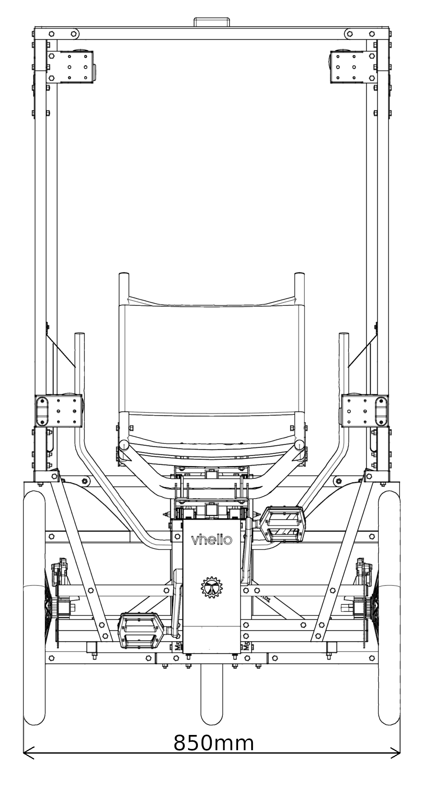
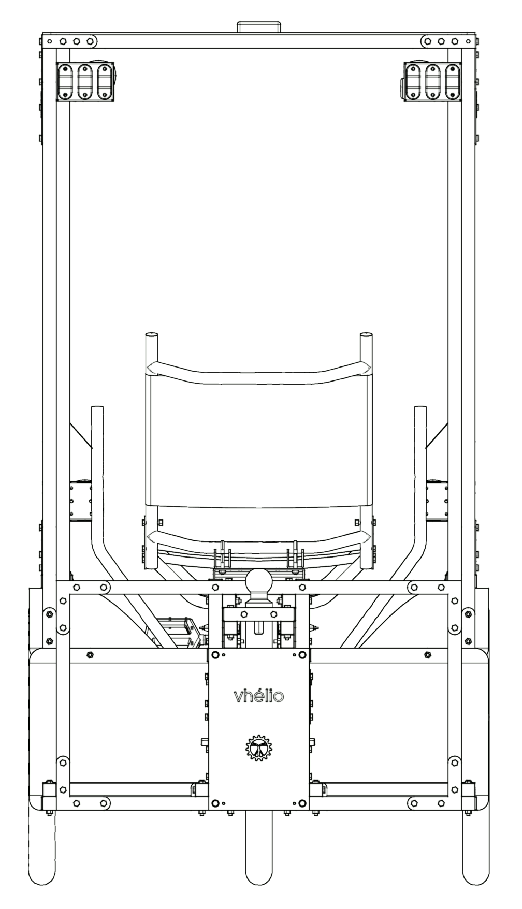

# Plan général

## Coté droit

```{image} img/cote_droit.png
:alt: Coté droit
:align: center
```

## Coté gauche

```{image} img/cote_gauche.png
:alt: Coté gauche
:align: center
```

## Avant/Arrière




## Vue de dessus

```{image} img/dessus.png
:alt: dessus
:align: center
```
