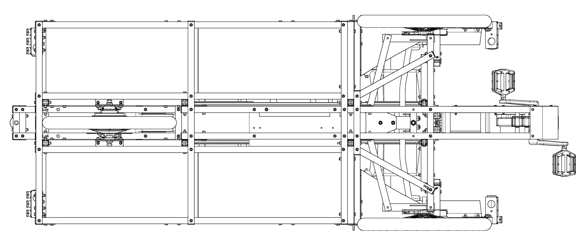

# Plan général

## Coté droit

```{image} img/cote_droit.png
:alt: Coté droit
:align: center
```

## Coté gauche

```{image} img/cote_gauche.png
:alt: Coté gauche
:align: center
```

## Avant/Arrière


## Vue de dessus

```{image} img/dessus.png
:alt: dessus
:align: center
```

## Vue de dessous



## Coupe longitudinale


## Coupes transversales

:::{figure-md}


vers l'avant
:::


:::{figure-md}


vers l'arrière
:::

## Coupe en altimétrie (à travers l’axe du pédalier, vue de dessus)


