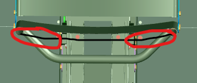

# Sièges

## Assemblage

Un siège de vhéliotech est constitué de 2 pièces en tubes métalliques soudés (le dossier et l’assise) qui sont assemblées entre elles avec deux équerres. Il faut ensuite mettre en place les bouchons de terminaison des tubes. Cet ensemble sera à monter sur une platine, avec le mécanisme de crantage pour le réglage sur la crémaillère centrale du vhéliotech. 

### Liste des pièces nécessaires

### Assemblage à blanc

### Serrage et réglages

## Garnissage

La résistance et le confort sont assurés par la mise en place d’un maillage de chambres à air usagées (que vous pouvez vous procurer facilement auprès d’un club de cyclotourisme local ou d’un vendeur de cycle). Il faut environ 10 chambres à air par siège.
Les chambres à air sont à tisser après avoir assemblé le siège (assise + dossier) et avant la fixation à l’embase.
Dans un premier temps, il faut couper les valves (avec des ciseaux) en retirant le moins possible de chambre à air (pour ne pas la fragiliser).
Tisser les chambres à air en les prolongeant progressivement avec des nœuds.
Pour ne pas gêner le confort, les nœuds doivent se retrouver sous le siège d’un côté ou de l’autre, mais pas au milieu (derrière le siège pour le dossier).

Attention, s’il est nécessaire de tendre à chaque tour de tissage pour que la chambre à air ne puisse se déplacer ou se détendre, il ne faut pas serrer trop fort, car l’effet élastique cumulé, tour après tour, pourrait déformer les barres du siège. Trouver la juste mesure pendant l’opération en surveillant l’état des barres. Lorsque la toile est mise en œuvre (ensuite, cela a tendance à rendre les chambres à air plus fermes qu’au moment du tressage).
Pour l’assise, superposer d’environ la moitié de la largeur de la chambre le tour précédent.
Au passage d’une chambre à air à la suivante, veiller à caler le nœud (s’il y en a qui ont été faits pour prolonger des chambres craquées) sous l’assise et au dos du siège pour que ce nœud ne gêne pas le confort de l’utilisateur.
Il est confortable de prévoir quelques petites sections de chambre à air, pour pouvoir précouvrir les boulons ou écrous au moment de les recouvrir par la « corde de chambre à air » pour amortir leur contact.
Les chambres à air ne résistent pas aux rayons du soleil et doivent être recouvertes de tissus.
Attention : En cas d’absence de tissus, les chambres à air déteignent sur les vêtements au contact de la transpiration.

## Habillage des toiles

Poser les toiles et tendre au moyen de tout type de ficelle, lacet ou élastique (diamètre 2 à 3 mm environ). Prévoir de la cordelette ou ficelle (2 à 3 mm environ). Longueur dossier 4m + 0,6 m, assise : 2,7 m + 1,5 m. En cas d’utilisation de ficelle non flexible, laisser du mou pour permettre un débattement des toiles accompagnant les chambres à air.
Le laçage se fait de la même façon que des lacets d’une chaussure.

Attention à la subtilité en haut du dossier (évite que la toile de dossier glisse avec le temps).

Les patrons de chaque toile sont fournis dans le dossier « Plans par article – Pour fabrication/Plans par article - Textiles ». La réalisation des toiles est d’une technicité simple concernant la couture. Seule particularité : les œillets doivent être bien posés (une machine professionnelle est préférable) pour êtres résistants.

## Sécurité

Pour un siège passager, il est indispensable (encore plus pour les enfants) d’ajouter une ceinture de sécurité deux points à fixer sur le montant du siège.
